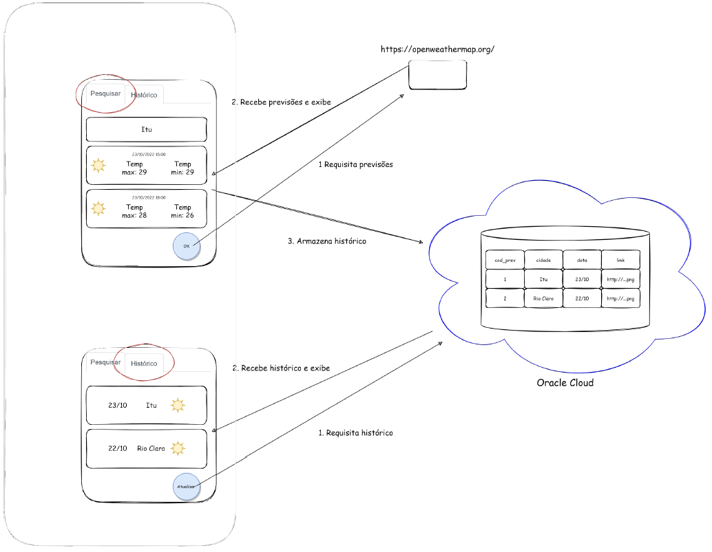

https://openweathermap.org/forecast5

# Programação para Dispositivos Móveis
## 5º Semestre do curso de *Análise e Desenvolvimento de Sistemas*
## Professor: Rodrigo Bossini
#
# Projeto P2 - APP Previsão do Tempo
# Grupo
| Nome | RA |
| ------------- | ------------- |
| Alana Roberta Santos da Costa Martins  | 2040482023033  |
| Diego Mendes Carloni  | 2040482023037  |
| Gabriel |   |
| Jaqueline Cantarino Cassimiro  | 2040482023010  |
| Mayara Pereira Dotta  | 2040482023049  |
#
### Neste projeto, será desenvolvido a solução computacional retratada pela abaixo:

